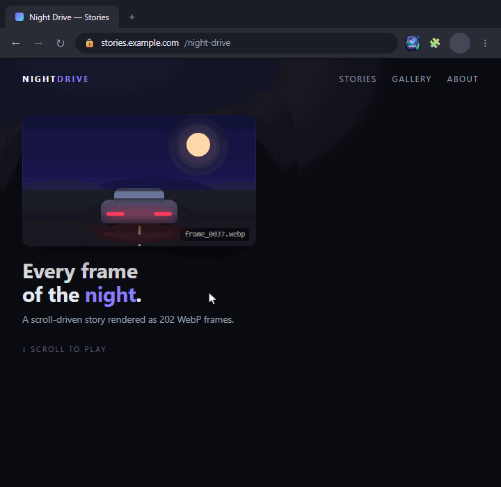

# WebP Frame Downloader

Detect and bulk download sequential WebP animation frames
directly from web pages.


**English** · [Türkçe](README.tr.md)

<p align="center">
  
</p>

## Why?

Some websites build scroll animations using hundreds of files like:

```
frame_0001.webp
frame_0002.webp
frame_0003.webp
...
frame_0202.webp
```

WebP Frame Downloader automatically detects the sequence,
finds its real start and end, and downloads every frame.

### Features

✓ Automatic sequence detection  
✓ Automatic first/last frame discovery  
✓ Deep scan for lazy-loaded frames  
✓ Direct frame URL analysis  
✓ Bulk download  
✓ Custom destination folder  
✓ English and Turkish interface  
✓ Chrome / Edge / Opera  
✓ No tracking, no analytics

## Installation

The extension is not on a web store yet, so you load it in developer mode:

1. Download or clone this repository.
2. Open the extensions page of your browser:
   - Chrome: `chrome://extensions`
   - Edge: `edge://extensions`
   - Opera: `opera://extensions`
3. Turn on **Developer mode**.
4. Click **Load unpacked** and select the repository folder.
5. Pin the extension to the toolbar.

The interface opens in English, or in Turkish if your browser is set to Turkish. Switch at any time with the **TR | EN** toggle in the top-right corner of the popup; the choice is remembered.

## Usage

### Scan the current page

1. Open the page with the animation and let it load.
2. Click the extension icon. The page is scanned automatically.
   - If no sequence is found, or it looks incomplete, click **Deep scan**. The first time, the browser asks for access to that site. The page then reloads and scrolls itself (10–30 seconds).
3. If several sequences are found, pick one from the list.
4. The extension finds the first and last frame on its own (`✓ Found automatically: …`). You can still edit the range by hand.
5. Choose how to download:
   - **Choose folder and download…** opens a small window. Pick a folder with **Choose folder…**, then click **Start download**. The first time, the browser asks for access to the server that hosts the frames (for example `*.cloudfront.net`). Keep the window open until the download finishes.
   - **Download to Downloads/animation_frames** uses the browser's own download manager and keeps going even if the popup closes.

Progress is shown as `87 / 202`.

### Analyze a URL

Type a URL into the **Analyze URL** field and click **Analyze**:

- **A page URL** (for example `https://racing.porsche.com`): the tab opens that page and runs a deep scan for you.
- **A frame URL** (for example `…/frames/frame_0202.webp`): the sequence is built from that one file, and its first and last frame are found automatically.

## How it works

- **Scanning** collects `.webp` URLs from loaded resources (Performance API), ``/`srcset`, lazy-load `data-*` attributes, CSS backgrounds and inline JSON. Files named `name_####.webp` in the same folder are grouped into one sequence, and zero padding (`0001`) is kept.
- **Deep scan**: by default the browser records only the first ~250 resources a page loads, so heavy sites can hide their frames. Deep scan raises that limit before the page loads, reloads the page, scrolls to the bottom to trigger lazy loading, and then scans.
- **First/last frame discovery** checks whether a frame exists by loading it as an image. It steps forward in growing jumps (1, 2, 4, 8…) and then narrows down with a binary search. A 400-frame sequence needs about 20 checks and no extra permission.

## Permissions

| Permission | Why |
|---|---|
| `activeTab` | Scan only the tab where you clicked the extension. No permanent access to any site. |
| `scripting` | Run the scanner inside that tab. |
| `downloads` | The "Download to Downloads/animation_frames" option. |
| `optional_host_permissions` | Asked at runtime, **only for the site involved**, and only when you use deep scan or "Choose folder and download". Installing the extension grants no site access. |

The extension does not use `storage`, `tabs`, analytics or any remote server of its own.

> **Why the optional permission?** The `chrome.downloads` API can only save into the Downloads folder. To write into a folder you choose, the extension has to fetch the files itself and save them with the File System Access API, and fetching from another server requires access to that server.

## Project structure

```
manifest.json   Extension manifest (MV3, minimal permissions)
popup.html      Popup UI
popup.css       Styles (light/dark theme variables)
popup.js        Popup logic: scanning, range detection, downloads
frames.js       Shared helpers: sequence parsing, first/last frame discovery, site permission
scanner.js      Functions injected into the page: scanner and auto-scroll
capture.js      Deep scan: lifts the 250-resource limit before the page loads
save.html/.js   "Choose folder" download window (File System Access API)
background.js   Deep scan flow + Downloads-folder download queue
i18n.js         Interface texts (English/Turkish) and the language switch
_locales/       Extension name and description per browser language
icons/          16, 32, 48, 128 px icons
docs/demo.gif   Demo animation shown at the top of this README
```

No build step and no framework: plain JavaScript, HTML and CSS.

## Known limitations

- A quick scan sees only the first ~250 resources the browser recorded. Use deep scan on heavy sites.
- Frames loaded inside a Web Worker do not show up in any scan. Paste the URL of one frame instead.
- First/last frame discovery assumes the frame numbers have no gaps.
- If every frame uses a different signed query string, only the first frame's query is reused, so other frames may fail.
- Choosing a folder overwrites files with the same name. Downloading to the Downloads folder renames them instead (`frame_0001 (1).webp`).

## Roadmap

- [x] Automatic first/last frame discovery
- [x] English interface with in-app language switch
- [ ] Download as a single ZIP
- [ ] Export as an animation (animated WebP / GIF / MP4)
- [ ] Optional subfolder per sequence

## License

MIT, see [LICENSE](LICENSE).
